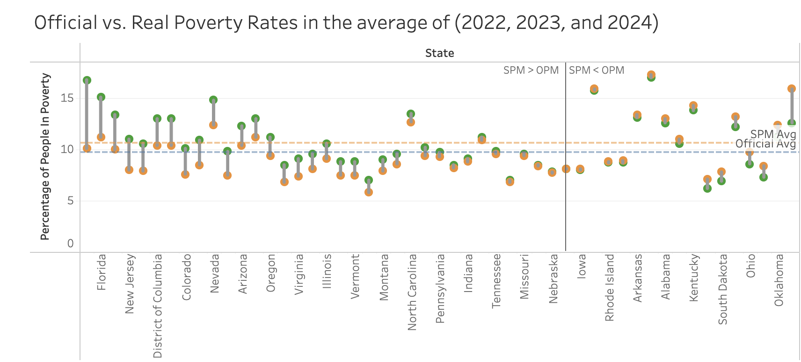

# Tell a story

blah blah blah 

<div class="grid grid-cols-1">
  <div class="card">
    
  </div>
</div>

## LA County - Public Assistance by Employment Income

```js
import {csvParse} from "d3-dsv";

// Load the CSV data
const raw = await FileAttachment("data/prd_calculations (1).csv").text();
const data = csvParse(raw, d => {
  // Calculate EITC (federal + state)
  const eitc = (+d["value.eitc.fed"] || 0) + (+d["value.eitc.state"] || 0);
  
  return {
    income: +d.income,
    EITC: eitc,
    SNAP: +d["value.snap"] || 0,
    "Medicaid for Children": +d["value.medicaid.child"] || 0,
    "Health Insurance Marketplace Subsidy": +d["value.aca"] || 0
  };
}).filter(d => d.income > 0);

// Melt data for stacking
const stackedData = [];
for (const d of data) {
  for (const category of ["EITC", "SNAP", "Medicaid for Children", "Health Insurance Marketplace Subsidy"]) {
    stackedData.push({
      income: d.income,
      program: category,
      value: d[category]
    });
  }
}
```

```js
function stackedBarChart({width}) {
  // Calculate max income and create ticks at 10k intervals
  const maxIncome = Math.max(...data.map(d => d.income));
  const xTicks = [];
  for (let i = 0; i <= maxIncome; i += 10000) {
    xTicks.push(i);
  }
  
  return Plot.plot({
    x: {
      label: "Employment Income",
      tickFormat: d => `$${d / 1000}K`,
      ticks: xTicks
    },
    y: {
      label: "Dollar Value",
      tickFormat: d => `$${d / 1000}K`
    },
    color: {
      legend: true,
      label: "Program",
      domain: [
        "EITC",
        "SNAP",
        "Medicaid for Children",
        "Health Insurance Marketplace Subsidy"
      ],
      range: [
        "#6b4226", // EITC
        "#d95f0e", // SNAP
        "#fdae61", // Medicaid for Children
        "#1a9850"  // Marketplace Subsidy
      ]
    },
    marks: [
      Plot.barY(stackedData, {
        x: "income",
        y: "value",
        fill: "program",
        order: "appearance",
        tip: true
      })
    ],
    width,
    height: 350
  });
}
```

<div class="grid grid-cols-1">
  <div class="card">
    ${resize((width) => stackedBarChart({width}))}
  </div>
</div>

## LA County - Net Resources by Employment Income

```js
// Load CSV data for net resources calculation
const rawNetResources = await FileAttachment("data/prd_calculations (1).csv").text();
const netResourcesData = csvParse(rawNetResources, d => {
  const income = +d.income || 0;
  
  // Add up benefits
  const eitc = (+d["value.eitc.fed"] || 0) + (+d["value.eitc.state"] || 0);
  const benefits = 
    (+d["value.snap"] || 0) + 
    (+d["value.medicaid.child"] || 0) + 
    (+d["value.aca"] || 0) + 
    eitc;
  
  // Add up taxes
  const taxes = 
    (+d["tax.income.fed"] || 0) + 
    (+d["tax.income.state"] || 0) + 
    (+d["tax.FICA"] || 0);
  
  // Expenses — FIXED: only one housing field used
  const expenses = 
    (+d["exp.rentormortgage"] || 0) +  // use this one, not exp.housing
    (+d["exp.food"] || 0) +
    (+d["exp.childcare"] || 0) +
    (+d["exp.healthcare"] || 0) +
    (+d["exp.misc"] || 0) +
    (+d["exp.transportation"] || 0) +
    (+d["exp.tech"] || 0) +
    (+d["exp.schoolMeals"] || 0);
  
  // Net resources calculation
  const netResources = income + benefits - taxes - expenses;
  
  return {
    income,
    netResources
  };
}).filter(d => d.income > 0);
```

```js
function netResourcesChart({width}) {
  return Plot.plot({
    x: {
      label: "Employment Income",
      tickFormat: d => `$${d / 1000}K`,
      fontSize: 12,
      fontWeight: "bold"
    },
    y: {
      label: "Net Resources",
      grid: true,
      tickFormat: d => `$${d / 1000}K`,
      fontSize: 12,
      fontWeight: "bold"
    },
    marks: [
      Plot.line(netResourcesData, { 
        x: "income", 
        y: "netResources", 
        stroke: "darkred", 
        strokeWidth: 6,
        tip: true
      }),
      // Optional dots for data points with tooltip
      Plot.dot(netResourcesData, {
        x: "income",
        y: "netResources",
        title: d => `Employment Income: $${d.income.toLocaleString()}\nNet Resources: $${Math.round(d.netResources).toLocaleString()}`,
        fill: "darkred",
        r: 3
      }),

      Plot.ruleY([0], { 
        stroke: "black", 
        strokeDasharray: "5,5", 
        strokeWidth: 4
      })
    ],
    width,
    height: 350
  });
}
```

<div class="grid grid-cols-1">
  <div class="card">
    ${resize((width) => netResourcesChart({width}))}
  </div>
</div>
